# chefdommm-Unit-19-Homework-Cryptocurrency-Wallet

____
___
## DESCRIPTION
___
`In this assignment I worked for a startup company that is building a new and disruptive platform called KryptoJobs2Go. KryptoJobs2Go is an application that its customers can use to find fintech professionals from among a list of candidates, hire them, and pay them. As KryptoJobs2Go’s lead developer, I was  tasked with integrating the Ethereum blockchain network into the application in order to enable customers to instantly pay the fintech professionals whom they hire with cryptocurrency.
In this Challenge, I had to complete the code that enables customers to send cryptocurrency payments to fintech professionals.` 

## Creating Description
I had to use two Python files, both of which were contained in the starter folder.
1. The first file that I used called krypto_jobs.py, contained the code associated with the web interface of the application. The code included in this file was compatible with the Streamlit library. 
2. The second file was called crypto_wallet.py. This file contained the Ethereum transaction functions that I created. By using import statements, I integrated the crypto_wallet.py Python script into the KryptoJobs2Go interface program that was found in the krypto_jobs.py file.
___
* Integrating these two files will allowed me  to automate the tasks associated with generating a digital wallet, accessing Ethereum account balances, and signing and sending transactions via a personal Ethereum blockchain called Ganache.
## Steps

1. Generate a new Ethereum account instance by using the mnemonic seed phrase provided by Ganache.

2. Fetch and display the account balance associated with your Ethereum account address.

3. Calculate the total value of an Ethereum transaction, including the gas estimate, that pays a KryptoJobs2Go candidate for their work.

4. Digitally sign a transaction that pays a KryptoJobs2Go candidate, and send this transaction to the Ganache blockchain.

5. Review the transaction hash code associated with the validated blockchain transaction.

6. Once I received the transaction’s hash code, I had to  navigate to the Transactions section of Ganache to review the blockchain transaction details. To confirm that I successfully created the transaction,

## Inspect the Transaction
___
* Integrated Ethereum wallet. 
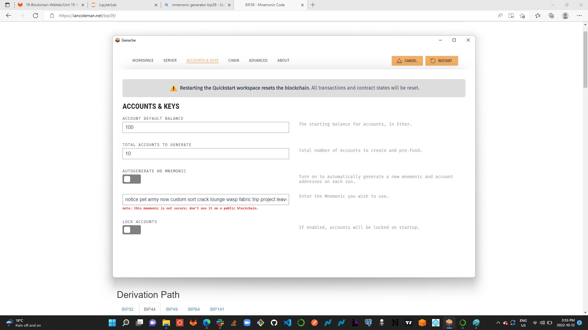
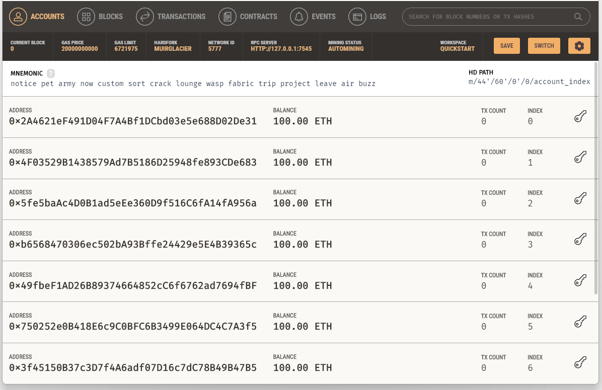

### `Launch the Streamlit application, type streamlit run krypto_jobs.py.`

___
___

## Hiring Transactions
### `Candidate Ash`
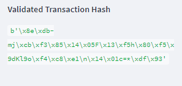
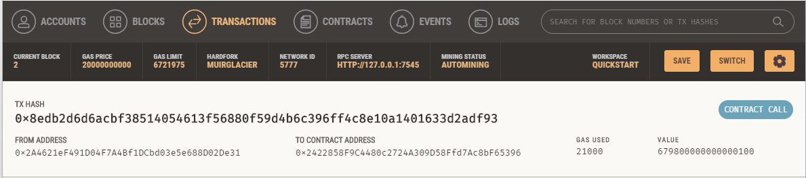

___
### `Candidate Jo`
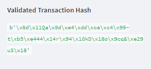
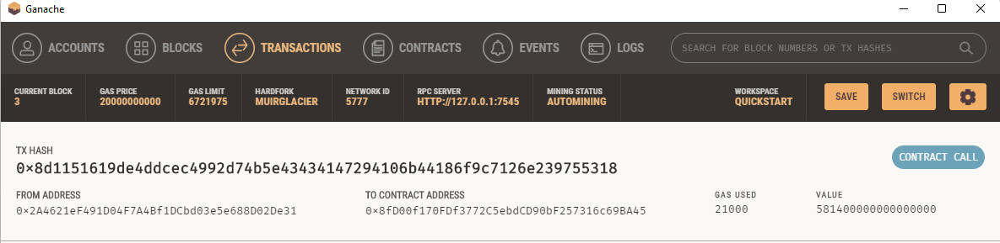

___
### `Candidate Lane`
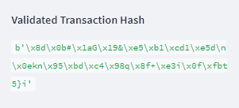
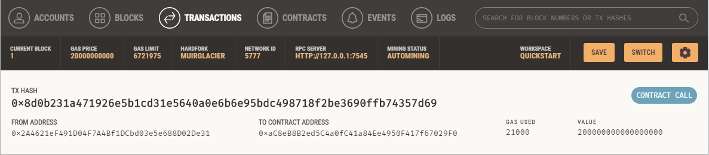

___
### `Candidate Kendall`
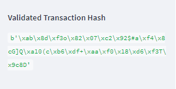
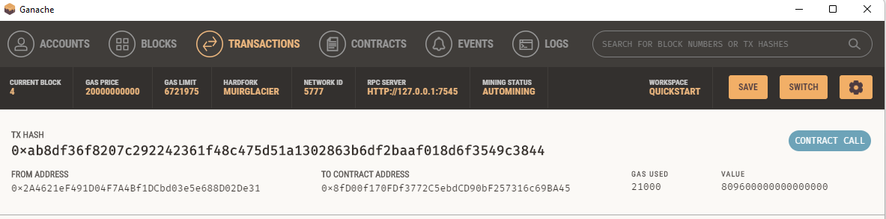

___
___
___

### Address balance Ganache history
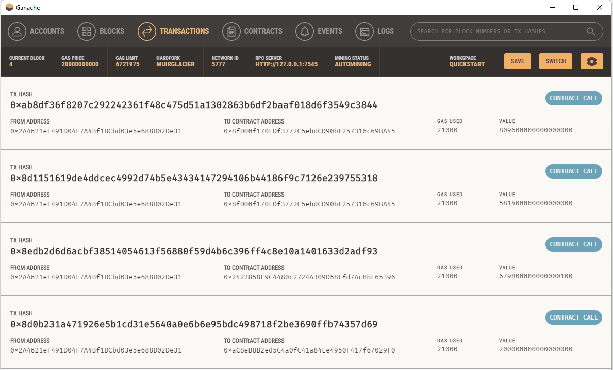

